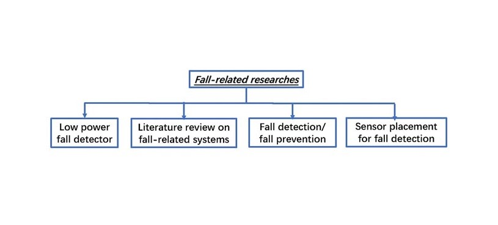
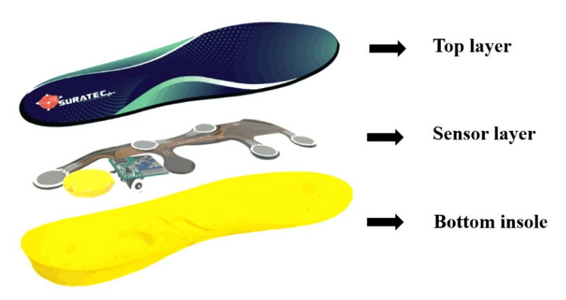
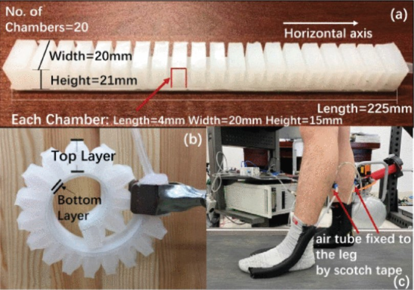
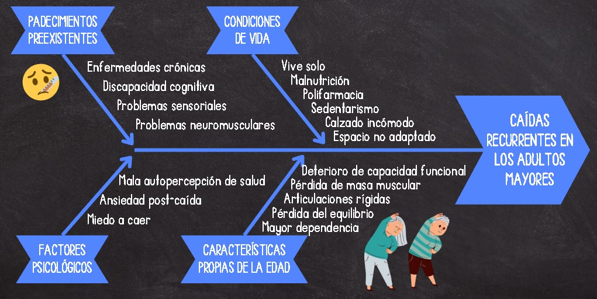

FUNDAMENTOS DE BIODISEÑO
<h1><b> ENTREGABLE Nº1</b></h1>

<h2>CONTEXTO CIENTIFICO</h2>

>

<h2>ENSAYOS CLINICOS</h2>

> <h3>Research of Fall Detection and Fall Prevention Technologies: A Systematic Review</h3>
> 
 El artículo busca concretar la situación de los estudios relacionados a la prevención y detección de caídas en el adulto mayor. Realiza la revisión mediante una clasificación de los estudios en 4 categorías: literatura previa sobre sistemas relacionados a las caídas, dispositivos basados en aparatos o sensores, tecnologías energéticamente eficientes y colocación de sensores. Se determinan 4 limitaciones comunes: la data utilizada para el desarrollo de proyectos viene de un ambiente controlado y no realista; el uso de varios sensores produce redundancia y mayores costos en los sistemas; no se puede generalizar la información obtenida en un estudio; y, no se considera lo suficiente las falsas alarmas en los sistemas como obstáculo en su aplicación en la vida real.

>
> 
</a>

>
> <h3>Fall Risk Prediction Using Wireless Sensor Insoles With Machine Learning</h3>
> 
 Se realizó un ensayo clínico en un hospital en Tailandia a 1101 voluntarios mayores de 65 años. Este consiste en caminar 3 metros ida y vuelta, utilizando suelas con sensores de presión inalámbricos para recolectar data que identifica si el sujeto está o no en riesgo de caída. Esta se procesa mediante 6 métodos de machine learning (ML) a fin de compararlos y determinar el más exacto. Se destaca el uso del centro de presión (COP) para el estudio de la marcha y balance en la predicción de caídas en el adulto mayor. Como resultados se obtuvo que el modelo de ML random forest (RF) obtuvo la mayor precisión y se concluyó que el uso de sensores de presión en la suela son efectivos para predecir caídas.

>
> 
</a>

>
> <h3>A Soft Robotic Intervention for Gait Enhancement in Older Adults</h3>
> 
 Se busca disminuir la variabilidad de la marcha, directamente relacionada a la probabilidad de caídas, mediante un dispositivo de robótica blanda en los tobillos que provee asistencia a la dorsiflexión del pie. El experimento implica a 24 adultos mayores de 60+ años que usan una caminadora durante 2 minutos 3 veces: sin sistema, sistema inactivo y sistema activo. El dispositivo activo disminuye significativamente la variabilidad de la marcha en adultos con alto riesgo de caída a una velocidad de actividades de vida diaria. Las ventajas son: mayor comodidad al no ser rígido; potencial para reducir el volumen del dispositivo; implementación de  músculos neumáticos artificiales (PAM) en este ámbito. Las limitaciones consisten en que solo se centra en dorsiflexion, mas no inversión y eversión; y, que se aplican condiciones específicas.

> 
> 
</a>

<h2>DIAGRAMA DE ISHIKAWA</h2>

> 
</a>

>

