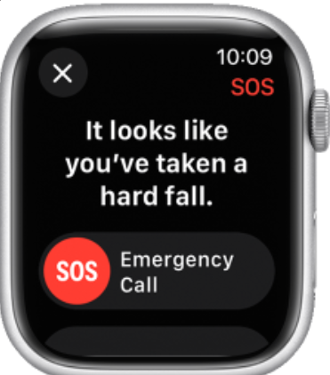
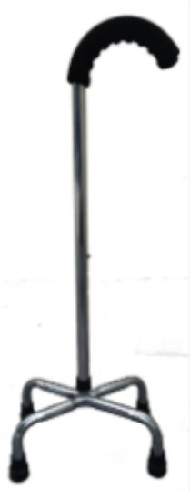
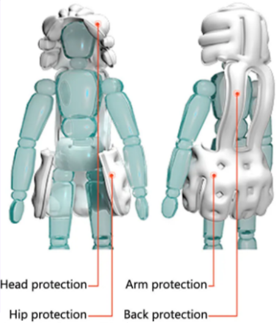
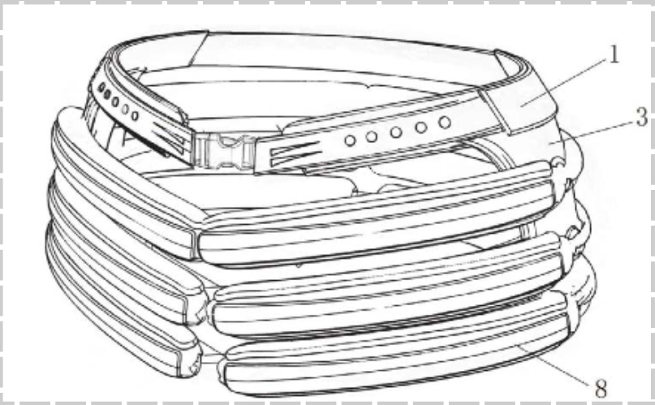
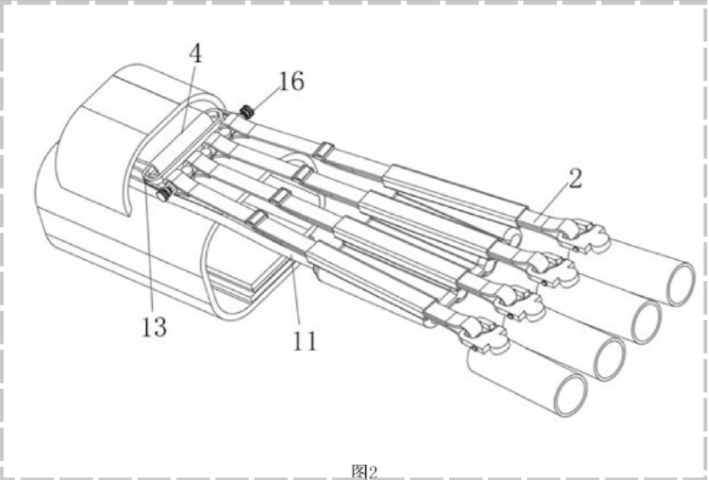
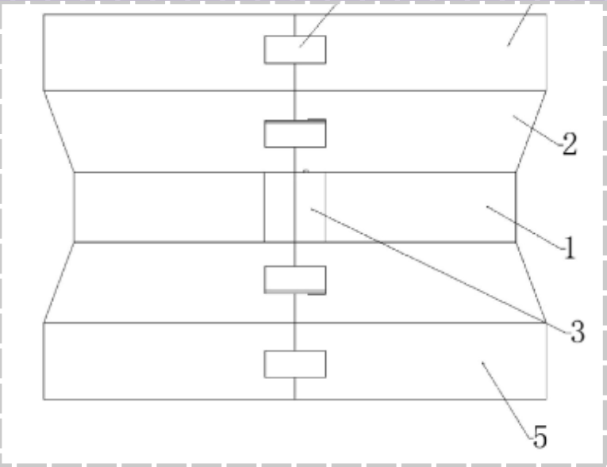
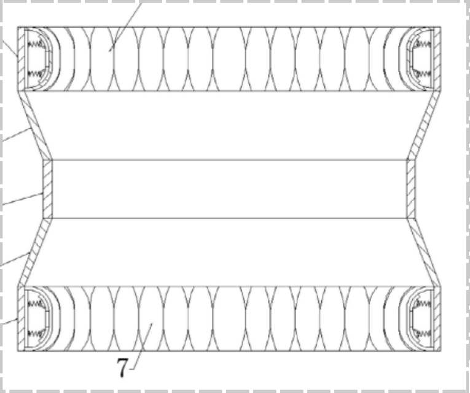

<h1> ENTREGALBE Nº2</h1>

<h2> Estado del arte (Contexto comercial)</h2>
  <h3> Productos </h3>
    <ul>
      <li><b>FallCall Older Adult Monitoring and Fall Detection Apps</b></li>
        <ul>
            <li> Alto: 41 mm </li>
            <li> Ancho: 35 mm </li>
            <li> Grosor: 10.7 mm Peso (Aluminio, GPS): 31.9 g </li>
            <li> Peso (Aluminio, GPS + Cellular): 32.1 g </li>
            <li> Peso (Acero inoxidable): 42.3 g </li>
        </ul>
        
</a>

      <li><b>Cuadrípode o Bastón de 4 “patas”</b></li>
        
La longitud correcta del bastón es aproximadamente la mitad de la altura del cuerpo del usuario cuando lleva zapatos.

        
</a>

      <li><b>HIDON-Chaleco de airbag anticaída para personas mayores</b></li>
          <ul>
              <li> Tiempo de reconocimiento de caidas: 0,1 s;</li>
              <li> Tiempo de apertura del Airbag: 0,08 s;</li> 
              <li> Batería: Batería de litio integrada de 5000mAh; </li>
              <li> GPS: soporte GPS;</li>
              <li> Comunicación: Los teléfonos móviles se conectan a la ropa a través de BT y las aplicaciones se ejecutan sincrónicamente: cada dispositivo puede conectarse a múltiples terminales móviles, y cada aplicación puede conectarse a múltiples dispositivos, El equipo activa la protección, luego la aplicación envía una alarma; Mostrar información de posicionamiento del equipo; Registra la información de los pasos de 7 días y el seguimiento del movimiento del equipo.</li>
          </ul>
        
</a>

    </ul>
  <h3> Patentes </h3>
    <ul>
      <li><b>Dispositivo anticaída de emergencia para las articulaciones de la cadera de personas mayores</b></li>
        
La realización de la presente invención proporciona un dispositivo anticaída de emergencia para la articulación de la cadera de personas mayores , que incluye un cuerpo principal de uso, dos lados del cuerpo principal de uso están provistos simétricamente de partes sobresalientes, las partes sobresalientes están rellenas con dos juegos. de bolsas de aire y las direcciones de expansión de los dos juegos de bolsas de aire son diferentes; la bolsa de aire está conectada a un dispositivo de inflado, y el dispositivo de inflado puede hacer que la bolsa de aire se expanda a ambos lados de la porción sobresaliente para cubrir circunferencialmente la articulación de la cadera. Como forma de implementación adicional, una pluralidad de puertos de llenado están dispuestos simétricamente a ambos lados de la porción sobresaliente, y cada puerto de llenado está provisto de una bolsa de aire. Como forma de implementación adicional, se proporciona una capa aislante en el lado interior de la parte sobresaliente. Como forma de implementación adicional, la porción sobresaliente se extiende en forma de arco desde un extremo conectado al cuerpo de desgaste hasta el otro extremo. Como forma de implementación adicional, el dispositivo de inflado incluye un tanque de aire y un mecanismo de perforación, y el tanque de aire está conectado al airbag a través del mecanismo de perforación.

        
</a>

</a>

      <li><b>Dispositivo de prevención de caídas para personas mayores</b></li>
        
Este prototipo consiste en una cinta elástica cual en los extremos cuenta con una hebilla de fijación para un fácil uso así como usar una faja además cuenta con un interior acolchado para reducir el impacto de la cadera contra el suelo.

        
</a>

      <li><b>Dispositivo protector y amortiguador de las articulaciones de la muñeca en caso de caídas de personas mayores</b></li>
        
El prototipo contiene un dispositivo protector y amortiguador para la zona  de la muñeca en caso de caídas de personas mayores. El dispositivo comprende de protección para los dedos actuando como si fuera una funda utilizada para amortiguar y proteger las articulaciones de las muñecas de las personas mayores cuando la persona mayor se cae, adicionalmente se utilizan otros dispositivos de protección,  la palma está protegida a través de un cojín de bolsa de aire y se evita que se raye, el aire se transmite convenientemente al cojín de bolsa de aire a través de un tubo de aire y una bolsa larga cuando se extruye el cojín de bolsa de aire, y la tensión amortiguadora de un anillo elástico a la La palma aumenta, por lo que se previenen eficazmente el esguince de la articulación de la muñeca y la contusión causada por el hecho de que la persona mayor dobla la palma rápidamente y la amplitud de flexión es grande.

        
</a>

</a>

    </ul>
  <h2> Lista de Requerimientos</h2>
    <h3>funcionales</h3>
      <ul>
        <li> Medir el movimiento del usuario mediante un sistema de sensores </li>
        <li> Detectar un ritmo irregular en el caminar del usuario </li>
        <li> Emitir una notificación sobre riesgo de caida </li>
      </ul>
    <h3>no funcionales</h3>
      <ul>
        <li> Ser ergonómico </li>
        <li> Fácil de portar durante el transcurso del día </li>
        <li> No voluminoso</li>
        <li> Costo asequible</li>
      </ul>
  <h2>Idea de solucion</h2>
    
Un sistema compuesto por sensores en el cuerpo de usuario, capaces de medir el movimiento de sus extremidades, y un microcontrolador, capaz de detectar irregularidades, usando los datos recibidos de los sensores, y emitir una notificación alertando sobre riesgo de tener una caida.

    
