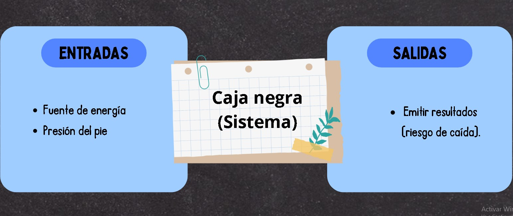
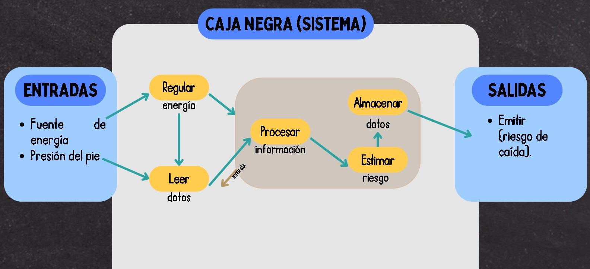
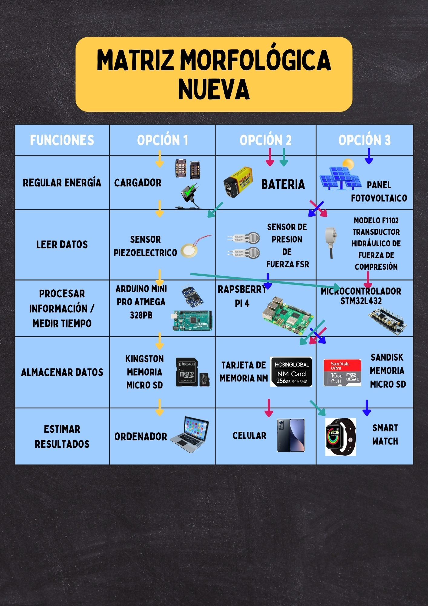

<h1><b> ENTREGABLE Nº3</b></h1>

<h2>CAJA NEGRA</h2>

> 
<b> En nuestro proyecto, la Caja Negra es una metáfora del dispositivo que estamos diseñando para prevenir las caídas en los adultos mayores. Aquí, concebimos la funcionalidad esencial sin entrar en la complejidad interna, definiendo claramente las entradas, como la energía y la presión del pie, y las salidas, como la presión ejercida por el músculo neumático artificial y las alertas de riesgo de caída. </b>

> 
</a>

<h2>LISTA DE ENTRADAS Y SALIDAS</h2>

> 
<b>Las entradas de nuestro sistema incluyen fuentes de energía y la presión del pie, detectadas por sensores especializados. Las salidas son la presión adaptativa ejercida por el músculo neumático artificial y las alertas vibratorias, que juntas forman la respuesta del sistema ante situaciones de riesgo.</b>

> <h3>ENTRADA</h3>

> 
Presión del pie: El sistema medirá la presión del pie en diferentes áreas de la planta del pie durante la marcha.

> 
Sensores de presión: Los sensores detectarán la fuerza y la ubicación de la presión en el pie, lo que permitirá identificar patrones de marcha anormales e indicativos de riesgo de caída.

> <h3>PROCESAMIENTO</h3>

> 
Análisis de datos: Los datos de los sensores de presión se analizarán en tiempo real para identificar patrones anormales de presión que podrían indicar un desequilibrio o inestabilidad durante la marcha.

> 
Algoritmos de predicción: Se utilizarán algoritmos de aprendizaje automático para predecir el riesgo de caída en función de los patrones de presión detectados.

> <h3>SALIDA</h3>
> 
Músculo neumático artificial (APM): En caso de detectarse un riesgo elevado de caída, el APM se activará y aplicará una fuerza en una dirección específica para corregir el desequilibrio y proporcionar estabilidad al tobillo del usuario.

> 
Sensor de alerta: Si el APM no logra corregir el desequilibrio y persiste el riesgo de caída, se activará un sensor de alerta. Este sensor enviará una señal a un dispositivo móvil predefinido, alertando al cuidador o familiar del adulto mayor sobre la posibilidad de una caída inminente.

<h2> ESQUEMA DE FUNCIONES </h2>

> 
<b>Nuestro Esquema de Funciones detalla operaciones como la regulación de la energía, la lectura y procesamiento de datos, identificación de riesgos, y la respuesta mecánica. Esta delineación permite entender la interrelación y la secuencia de las funciones que componen nuestro dispositivo.</b>

> 
</a>

<h2> MATRIZ MORFOLÓGICA </h2>

> 
<b>La Matriz Morfológica presenta una exploración de opciones como el Raspberry Pi, sensores piezoeléctricos y músculos neumáticos, ofreciendo un panorama de componentes para cada función propuesta. Esta matriz es el fundamento para la selección innovadora y efectiva de la solución.</b>

> 
</a>

<h2> TABLA DE VALORACION </h2>

> 
<b>Mediante una evaluación técnica detallada, nuestra Tabla de Valoración asigna puntuaciones a los conceptos de solución, basados en criterios como usabilidad, portabilidad, coste y nivel de innovación. Esta tabla destila la viabilidad y el potencial de cada solución considerada.</b>

> 
</a>

>
> 
<b>Facilidad de uso:</b> La capacidad del dispositivo para ser utilizado de manera sencilla debido a su diseño compacto, peso ligero y funcionalidad intuitiva, lo que facilita su operación y mantenimiento por parte del usuario.

> 
<b>Portabilidad:</b> La capacidad del dispositivo para ser transportado fácilmente debido a su tamaño pequeño y peso reducido, lo que permite una movilidad conveniente para el usuario.

> 
<b>Costo de tecnología:</b> Los precios bajos asociados con la adquisición y desarrollo de la tecnología utilizada en el dispositivo, incluyendo tanto el hardware como el software necesarios para su funcionamiento.

> 
<b>Costo de operación:</b> El gasto continuo requerido para mantener y utilizar el dispositivo a lo largo del tiempo, incluyendo el consumo de energía, mantenimiento y posibles reparaciones.

> 
<b>Tamaño:</b> Las dimensiones físicas del dispositivo, que afectan su portabilidad, capacidad de integración y comodidad de uso, con énfasis en un tamaño pequeño para su integración en la suela u otro espacio limitado.

> 
<b>Nivel de innovación:</b> El grado de originalidad y avance tecnológico que ofrece el dispositivo en comparación con otras soluciones disponibles en el mercado.

> 
<b>Nivel de innovación:</b> El grado de originalidad y avance tecnológico que ofrece el dispositivo en comparación con otras soluciones disponibles en el mercado.

> 
<b>Posibilidad de automatización:</b> La capacidad del dispositivo para realizar tareas de manera autónoma o semiautónoma, reduciendo la intervención humana y mejorando la eficiencia en su funcionamiento.

> 
<h2> CONCLUSIONES </h2>

> 
 La cuarta propuesta fue la ganadora según los criterios de la tabla de valoración. Esta opción cumple con los objetivos principales establecidos para abarcar la problemática de caídas en los adultos mayores, los cuales son: tener la mejor relación calidad-precio en sus componentes; ser fácil de utilizar además de poco invasivo; y proveer estabilidad al usuario en riesgo de caída a fin de prevenir estos accidentes. 

