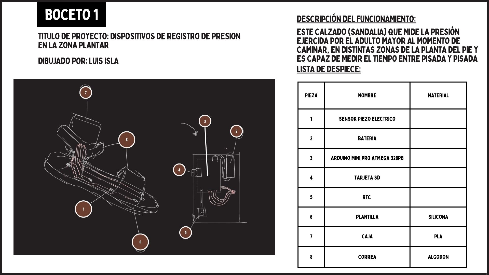
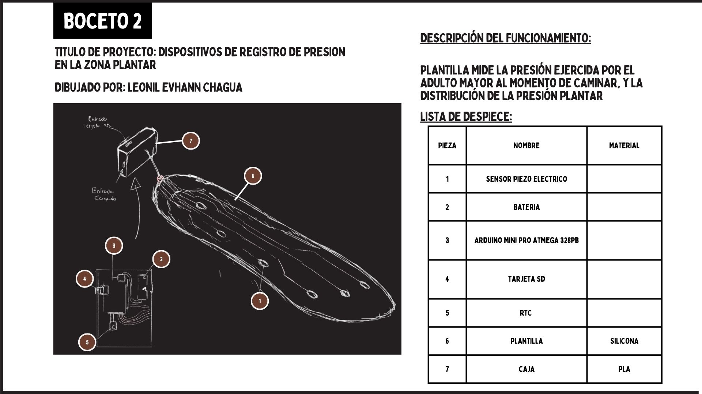
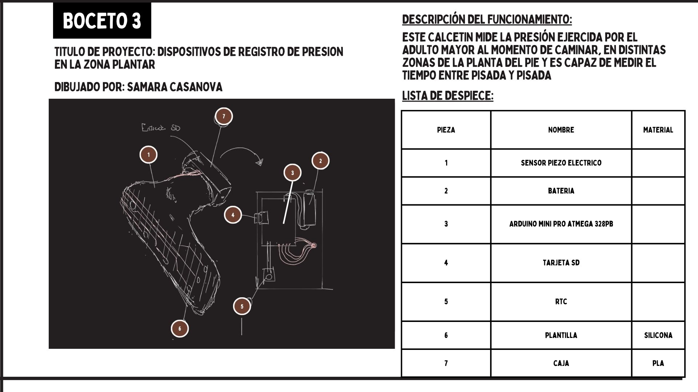
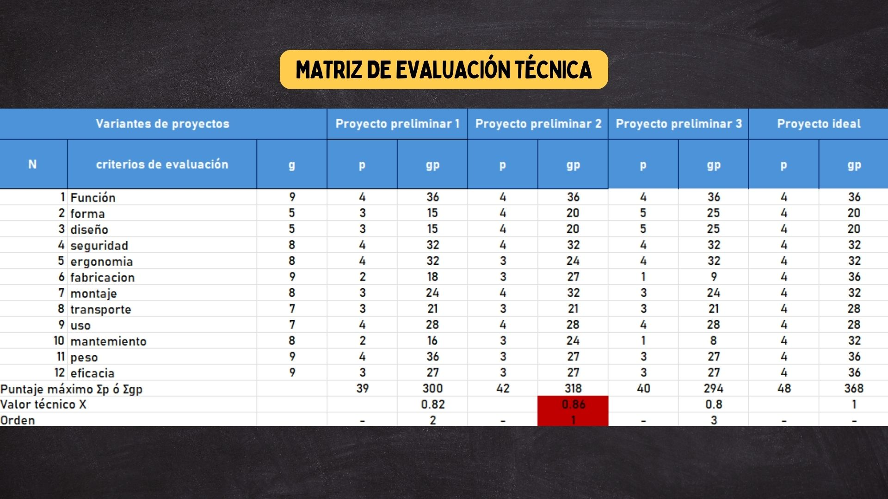
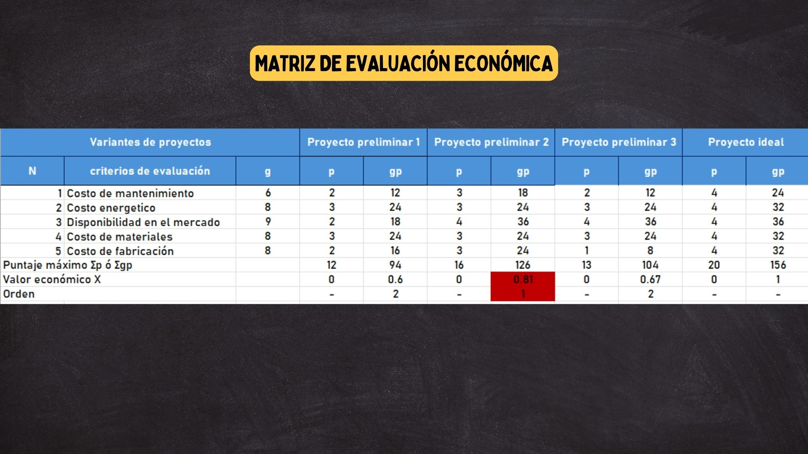
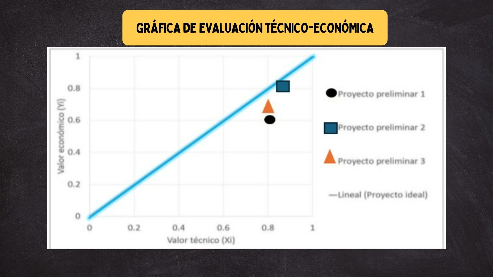

FUNDAMENTOS DE BIODISEÑO
<h1> ENTREGABLE 4</h1>
<h2> BOCETOS </h2>

> <h3> boceto 1</h3>
> 
</a>

>
> <h3> boceto 2</h3>
>
> 
</a>

>
> <h3> boceto 3</h3>
>
> 
</a>

>

<h2> TABLA DE VALORACION </h2>
<h3> TECNICA </h3>

> 
</a>

>

<h3> ECONOMICA </h3>

> 
</a>

>

<h3> GRAFICA </h3>

> 
</a>

>
