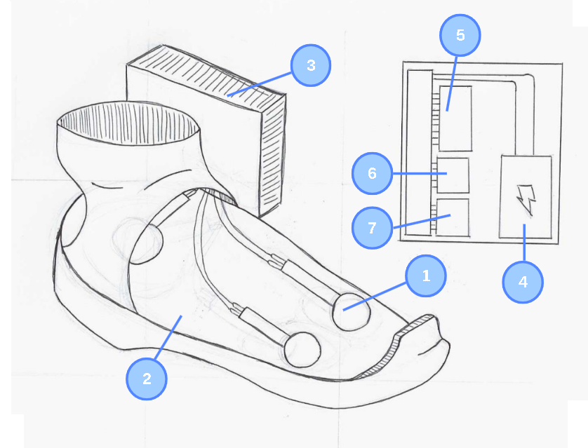
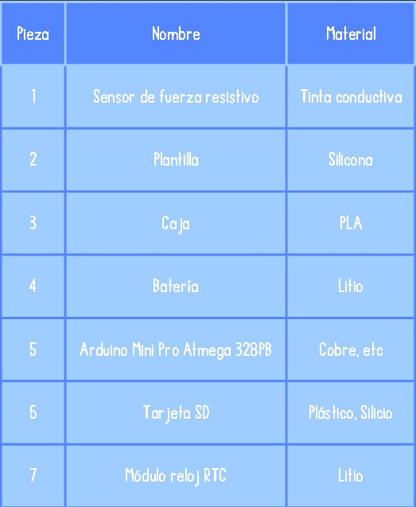
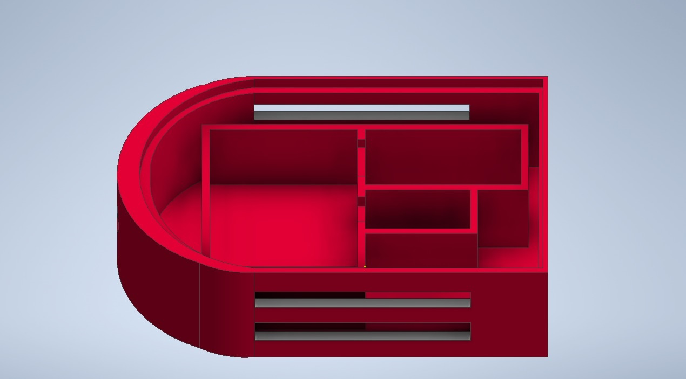
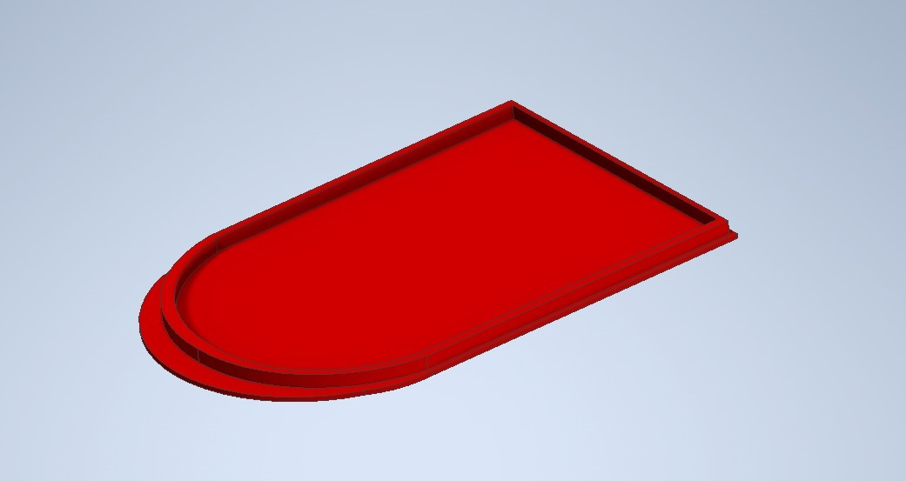
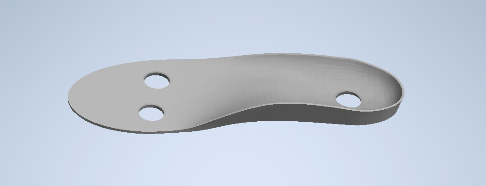
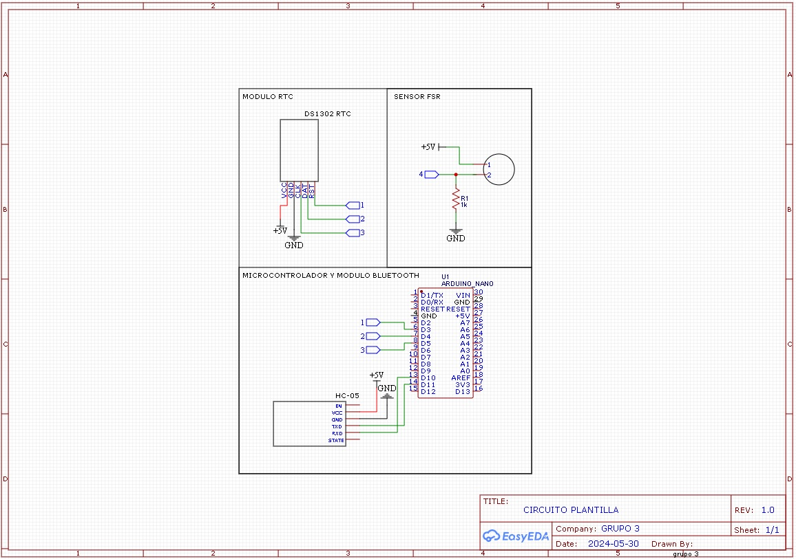

FUNDAMENTOS DE BIODISEÑO
<h1><b> ENTREGABLE Nº5</b></h1>

<h2>SOLUCION GANADORA</h2>

> <h3>BOCETO</h3>
> 
</a>

> <h3>COMPONENTES</h3>
> 
</a>

<h2>MODELADO 3D</h2>

> <h3>CAJA</h3>
> 
</a>

> <h3>TAPA</h3>
> 
</a>

> <h3>PLANTILLA</h3>
> 
</a>

<h2>DISEÑO ESQUEMATICO</h2>

> 
</a>

