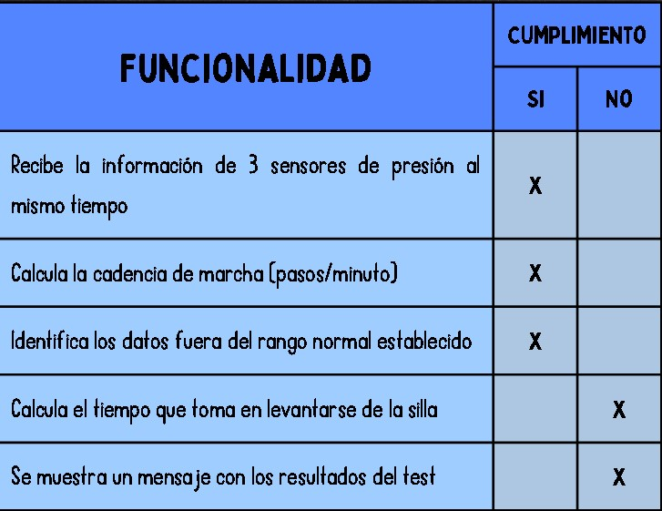
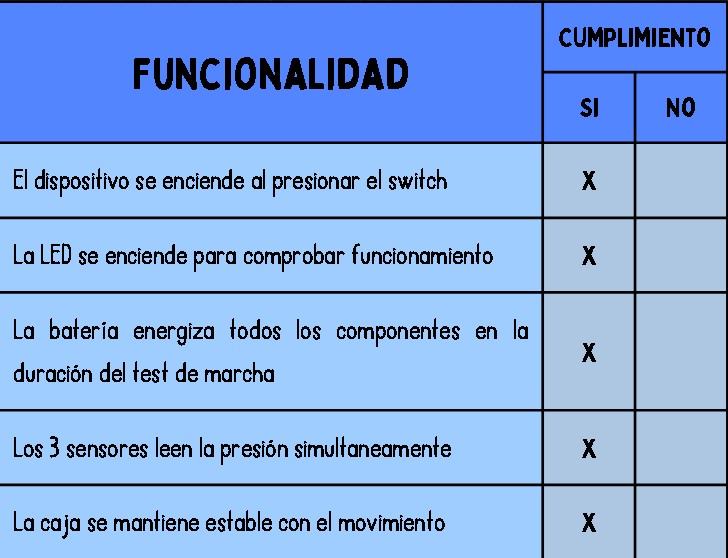
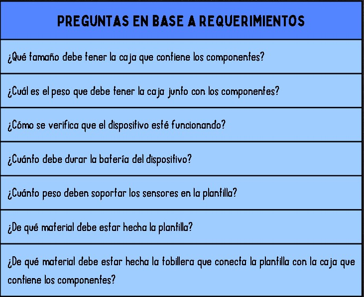
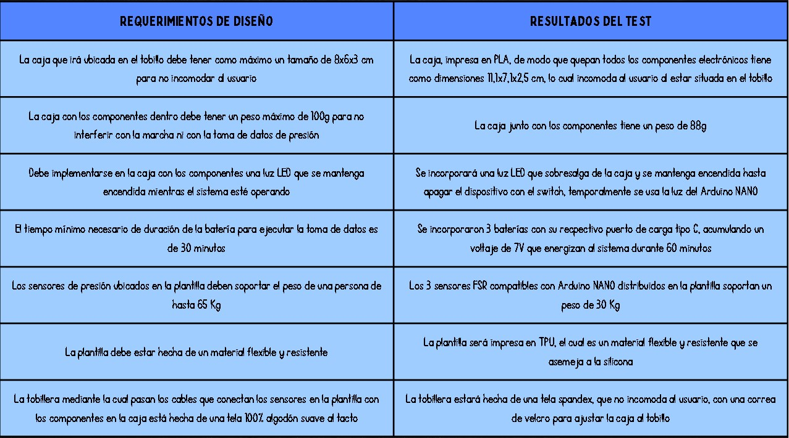

FUNDAMENTOS DE BIODISEÑO - EQUIPO 3 - 2024-1

<h1> ENTREGABLE 4</h1>
<h2> VERIFICACION DE DISEÑO</h2>

> <h3><b>Software-funcionalidad:</b></h3>
> 
</a>

>
> <h3><b>Hardware-funcionalidad:</b></h3>
>
> 
</a>

>
> <h3><b>hardware-requerimientos-test:</b></h3>
>
> 
</a>

> 
</a>

