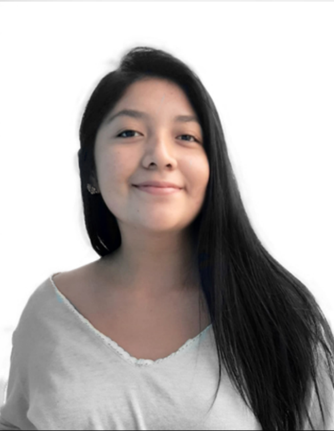
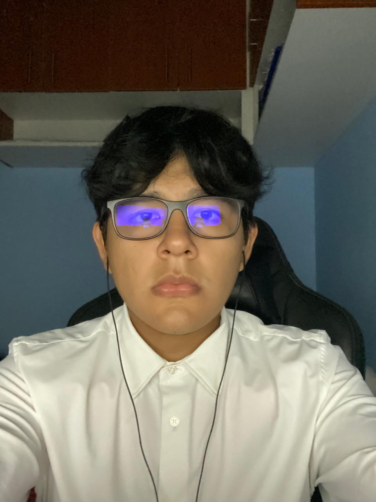

# Fundamentos de Biodiseño, Equipo 3
Proyecto de desarrollo de una solución tecnológica orientada a las caídas en adultos mayores

<h4>Equipo 3: </h4>
<ol>
<li><h5>LUIS LEONARDO MATHEUS ISLA FROYLAN (Investigador)</h5></li>

  
  
  · Mi nombre es luis, estudio ing biomedica me encuentro en tercer ciclo, escogi la carrera ya que formaba partes de la gama de mis gustos tecnologia-biologia-medicina, Me gusta la tecnologia/robotica, practicar deportes y trato cada dia en mejorar mi conocimiento en circuitos.

  Mi rol durante el curso es de desarrollador web. Soy encargado de el diseño y programacion de la página web, creacion de repositorios y actualizar la pagina web oficial conforme al avance del proyecto, documentando cada fase, asi como vincular la programacion de arduinos y algoritmos de la propuesta de solucion a la pagina web.

 
  
<li><h5>ROSA MELIZA BARRERA CAJAHUANCA (Coordinadora general, gestora de Github)</h5></li>

   

  · Mi nombre es Rosa, estudio Biología, estoy en 9no ciclo, escogí este curso como electivo de mi carrera ya que considero que la posibilidad de plantear desde la idea a la ejecución de un producto biomédico es relevante para mi linea de carrrera. Me gusta correr y salir a comer a nuevos lugares.
  
  

  
<li><h5>LEONIL EVHANN YARUD CHAGUA TERREROS (Programación)</h5></li>

   
   
  · Soy Leonil Chagua, estudiando de ingeniería-biomédica en 4to ciclo, elegí esta carrera por las oportunidades que brinda, me gusta dibujar, los videojuegos, y tengo familiaridad con programación y diseño 3D.
  
  El rol que tomare durante este proyecto es de programador. Soy el encargado de la programación en Python y C++, segun las necesidades del equipo, de la propuesta de solucion mi función será limpiar, codificar, trazar el código fuente, y elaborar los algoritmos para volver funcional nuestra propuesta en otras palabras,es indicarle al ordenador lo que tiene que hacer

 

<li><h5>EZAEL SERGIO CONDOR ORIHUELA (Modelador 3D)</h5></li>

   
   
  · Soy Sergio Condor y estoy estudiando ing biomedica y voy en 3er ciclo de la carrera , me matricule al curso para adelantar,en mi tiempo libre me gusta conocer/investigar nueva tecnologica, me gusta el anime y los videojuegos.
  Mi rol en este proyecto consiste en el diseño 3D de los bocetos que se realicen para la propuesta de solución y la preimpresión del mismo.Esto mediante el uso de AUTODESK INVENTOR y ULTIMAKER CURA. Ademas de la verificación de su correcta impresión.
  
  

  
<li><h5>SAMARA PATRICIA CASANOVA REYMER (Electrónica)</h5></li>

  

  · Soy estudiante de 3er ciclo de ingeniería biomédica. Elegí esta carrera porque confío en que el desarrollo tecnológico relacionado a la medicina genera un impacto positivo en la calidad de vida de las personas como ningún otro ámbito lo hace; deseo aportar con mis ideas y habilidades a este fin. Por otro lado, tengo una gran pasión por mi deporte, el waterpolo, es lo que más me hace feliz.

  El rol que tomare durante este proyecto es de dibujante tecnico. Sere la principal encargada de la elaboracion de los primeros bocetos y dibujos a mano alzada, en perspectiva para encaminar el diseño de la propuesta de solucion ademas a cargo de la elaboracion de tanto los diseños y planos para el posterior modelado en 3D

<li><h5>QHAPAQ INKARI AYQUIPA DAZA (Investigación)</h5></li>

  

  · Estudiante de 21 años, amante del emprendimiento y  de los negocios financieros. me gustan las cosas simples, como tomar un vasito de agua en la cima del monte everest. Mi rol consiste en recopilar información verídica y de calidad, además de verificar continuamente su procedencia y utilidad en la investigación . asimismo , corroborar        cuidadosamente cada una de las citaciones incluidas.
  
  

</ol>

